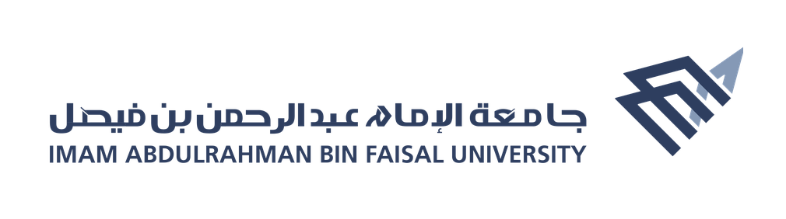

 

### Hi, I'm Amir Alsabea.

I'm an **Artificial Intelligence** student at **IAU** with a strong background in **AI, machine learning,** 
and **web development**. I enjoy building practical projects, 
solving technical problems, and exploring how **AI** can be integrated into modern **web applications**

### My goal:

Turn AI ideas into practical, working web applications that solve real problems.

 

### Studied at:

 

### Find me on:

## 💻 Tech Stacks:

- **Programming Languages:**

    
    
    
    
    

- **Web Development:**

  * **Frontend:**

    
    
    
    
    
    

  * **Backend:**

    
    
    
    
    

  * **Databases:**

    
    

- **AI & ML:**

  * **Data Science Libraries/Tools:**

    
    
    
    

- **Deployment & Version Control:**

    
    
    

- **Embedded System Development:**

    
    

## 📊 GitHub Stats:

## Projects:

- [Smart Hall System: AI-Powered Classroom Attention Tracking](https://github.com/Amir-Alsabea/Smart-Hall-System)
- [Cars Diagnosis Problems: Rule-Based Vehicle Diagnosis System](https://github.com/Amir-Alsabea/Cars-diagnosis-problems)
- [YelpCamp: Campground Discovery Web App](https://github.com/Amir-Alsabea/YelpCamp)
